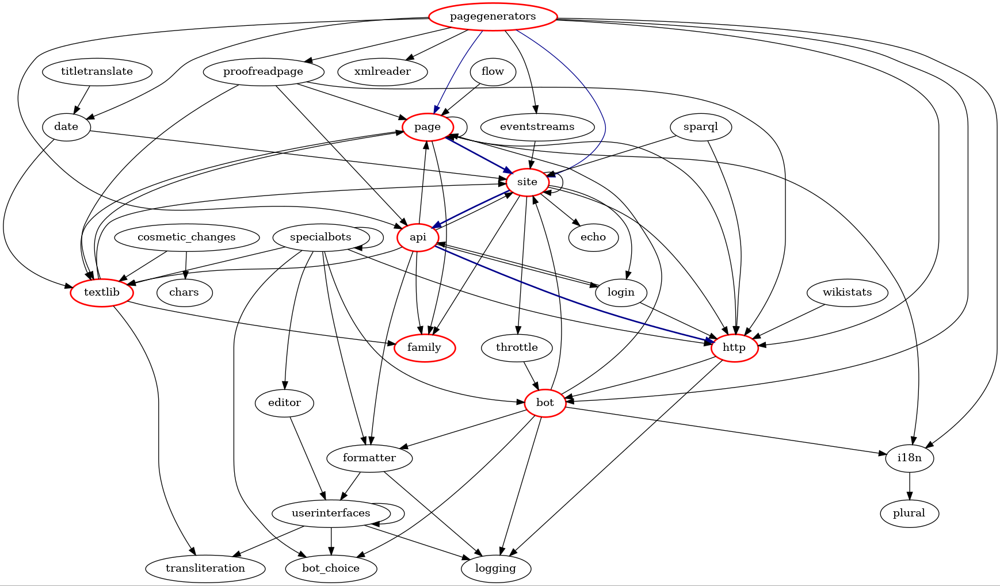

#######################
Pywikibot documentation
#######################

Welcome! This is the documentation for Pywikibot |release|.

**Pywikibot** is a Python library and collection of tools that automate work
on `MediaWiki <https://mediawiki.org>`_ sites. Originally designed for
Wikipedia, it is now used throughout the Wikimedia Foundation's projects and
on many other MediaWiki wikis.

The project started in 2003 and is currently on core version |version|.
It features full API usage and is up-to-date with new MediaWiki features and
a Pythonic package layout. But it also works with older installations of
MediaWiki 1.27 or higher. For older MediaWiki versions you have to use older
Pywikibot releases; refer :manpage:`Compatibility`.

Pywikibot supports Microsoft Windows, macOS and Linux when used with a
compatible version of Python. It should also work on any other operating
system that has a compatible version of Python installed. To check
whether you have Python installed and to find its version, just type
``python`` at the CMD or shell prompt.

Python 3.6.1 or higher is currently required to run the bot, but Python 3.7
or higher is recommended. Python 3.6 support will be dropped with Pywikibot 9.

Pywikibot and this documentation are licensed under the
:ref:`MIT license`;
manual pages on mediawiki.org are licensed under the `CC-BY-SA 3.0`_ license.

.. seealso:: `Pywikibot Manual`_ on https://www.mediawiki.org, which includes
   additional resources, such as:

   * `Pywikibot Cookbook`_
   * `Pywikibot Workshop Materials`_

**************************
Framework modules overview
**************************

********
Contents
********

.. toctree::
   :maxdepth: 1
   :caption: User guide

   introduction
   utilities/scripts
   scripts/index
   global_options
   faq
   getting_help

.. toctree::
   :maxdepth: 1
   :caption: Bot developer guide

   library_usage
   recipes
   api_ref/index
   mwapi

.. toctree::
   :maxdepth: 1
   :caption: Pywikibot contributor guide

   utilities/scripts_ref
   scripts_ref/index
   utilities/install
   tests_ref/index

.. toctree::
   :maxdepth: 1
   :caption: About

   glossary
   changelog
   licenses
   credits

.. _CC-BY-SA 3.0: https://creativecommons.org/licenses/by-sa/3.0/
.. _Pywikibot Manual: https://www.mediawiki.org/wiki/Manual:Pywikibot
.. _Pywikibot Cookbook: https://www.mediawiki.org/wiki/Manual:Pywikibot/Cookbook
.. _Pywikibot Workshop Materials: https://www.mediawiki.org/wiki/Manual:Pywikibot/Workshop_Materials
